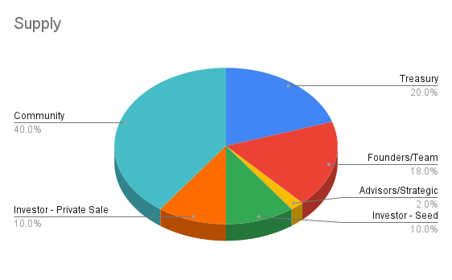
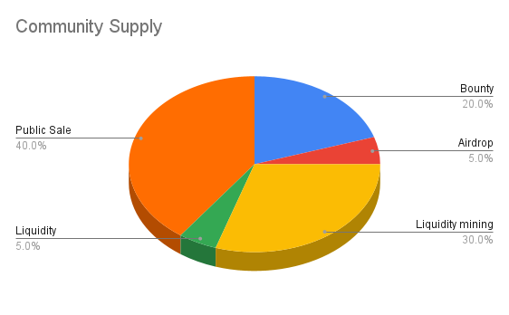
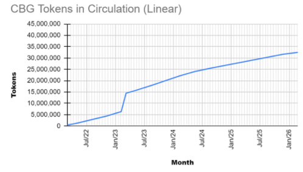
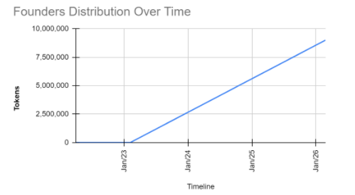

# Supply and Distribution

The Kyōdō Token (KYD) is an governance token which will allow holders to vote for upgrades. The token will be allocated in rounds into public and private sales, founders, seed, treasury, strategic YouTubers, airdrops and bounties, as follows:

The term "Community" refers to all of the KYD tokens that will be open for community members to acquire. Here's how this 40% (40,000,000 KYDs) will be distributed among bounties, airdrops, liquidity mining, liquidity, as well as the public sale:

We'll explain now what each term is about. Check the Table of Contents for quick access.

## Table of Contents

- [Supply and Distribution](#supply-and-distribution)
  - [Table of Contents](#table-of-contents)
    - [Circulating Supply](#circulating-supply)
    - [Treasury (20%)](#treasury-20)
    - [Founders/Team (18%)](#foundersteam-18)
    - [Seed (10%)](#seed-10)
    - [Private Sale (10%)](#private-sale-10)
    - [Strategic Advisors (2%)](#strategic-advisors-2)
    - [Community (40%)](#community-40)
      - [Public Sale (16%)](#public-sale-16)
      - [Liquidity Mining (12%)](#liquidity-mining-12)
      - [Bounties and Quests (8%)](#bounties-and-quests-8)
      - [Liquidity (2%)](#liquidity-2)
      - [Airdrops (2%)](#airdrops-2)

### Circulating Supply

The current circulating supply is 30,000,000, with a maximum total supply of 100,000,000. All the token allocations will enter the market asynchronously over 48 months, and some of them will be locked in for a year before doing so.

### Treasury (20%)

20% of the supply of the KYD token will be held by the [DAO Treasury](/tokenomics/treasury). This treasury will keep expanding, as long as new fees are collected. Every month the DAO will buy tokens with the fees collected.&#x20;

The community will decide strategically what to do with the Treasury in the [Kyōdō DAO](/dao/introduction) by vote, including partnerships, liquidity programs, and more.

This amount will remain locked for the first 12 months.

### Founders/Team (18%)

The Kyōdō team and founders will receive a total of 18,000,000 KYD tokens. However, this amount will be locked for the first 12 months, and will be distributed in its entirety along the next 36 months, following this graph:

It is worth noting that there will be an internal policy to determine whether a team member should get an amount of KYD, that will specially consider the time working in the team.

### Seed (10%)

A total of 10%, which is equivalent to 10,000,000 KYD tokens will be destined to the first round of investments. This sale will be used to raise funds for the development of Kyōdō Protocol.&#x20;

The KYD token will cost investors $0.08, so we expect to raise $800,000 for Kyōdō Protocol, which also means that this will be the best buying opportunity for KYD. The tokens acquired will not be locked, but will be distributed along 12 months.

### Private Sale (10%)

Another 10,000,000 KYD tokens will be sold to investors, at a cost of $0.24. This time, there will also be no locked period, but the tokens will be distributed along 36 months.

The funds raised will be used for the development of Kyōdō Protocol as well, including hiring more people for the team and marketing.

### Strategic Advisors (2%)

2,000,000 KYD tokens will be destined for a small amount of strategic advisors, who will be able to test the platform and advocate for it. These tokens will be locked for a year, and will be distributed along the next 24 months after the locking period.

### Community (40%)

#### Public Sale (16%)

The amount of 16,000,000 KYD tokens will be destined for public sales, which means that anyone in the commuity will be able to buy KYD tokens in a decentralized exchange or any other platform available.&#x20;
At this point in time, there will be 36,000,000 KYD tokens circulating.

#### Liquidity Mining (12%)

12,000,000 KYD tokens will be distributed to those who provide liquidity to KYD, in a liquidity program. The more liquidity someone provides, and for longer, the greater share of the KYD pool they will receive.

#### Bounties and Quests (8%)

The amount of 8,000,000 KYD tokens will be directed towards bounties, which refer to the rewards Community Managers who invite other Community Managers can earn.&#x20;

This distribution will happen over 3 phases. In the first one, 2.5% tokens, equivalent to 2,500,000 KYD will be assigned. In this first phase, each invited Community Manager will get 200 KYD, while the one who referred to Kyōdō will get 100 KYD.&#x20;

Followed by phase 2, 1.5% (1,500,000 KYDs) will be distributed, except that this time, the invited Community Manager will get 100 KYD and the one who referred, 50 KYD.&#x20;

In phase 3, 1.0% (1,000,000 KYD) of KYD tokens will be assigned, being 50 for the invited Community Manager and 20 for the Community Manager who invited them. All of the tokens will be locked for a year.

In addition, 3% of KYD, equivalent to 3,000,000 KYD, will be destined to Quests, and will be distributed among those community members who complete them. More details about these Quests will be defined in the future.

#### Liquidity (2%)

After the Public Sales happen, Kyōdō DAO will provide liquidity initially with the amount of 2,000,000 KYD tokens.

#### Airdrops (2%)

We'll dedicate 2,000,000 KYD tokens to community members who promote Kyōdō Protocol and engage with other community members, as well as early adopters of the platform. Specific criteria for these airdrops will be defined in the future.
